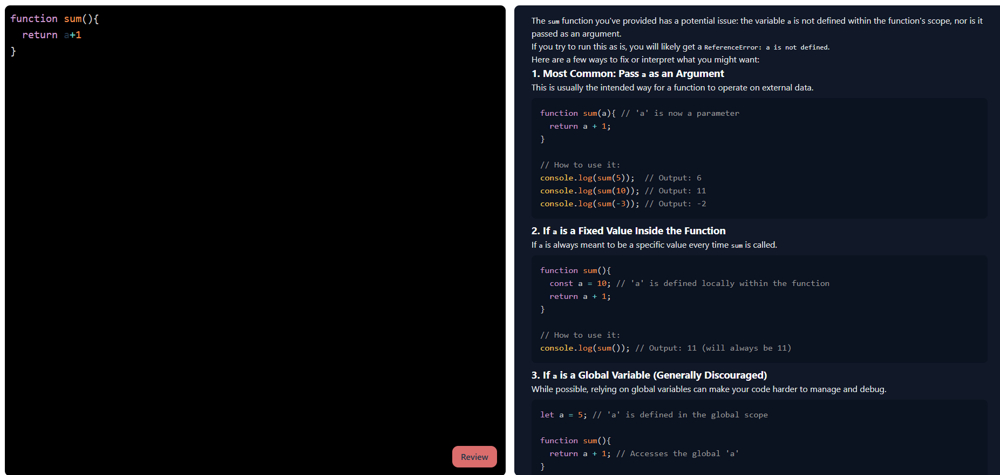

# Code Reviewer AI (LLM-Powered)

A web app that uses a Large Language Model (LLM) to automatically review code, detect potential issues, and suggest improvements/refactors. Focused on Generative AI for practical software-engineering tasks like code quality analysis, readability, performance, and maintainability.

### Features
- **LLM-driven** code reviews with clear, actionable feedback
- Structured output: **Summary → Key Issues → Recommendations → Example Revision**
- Live code editor with Prism syntax highlighting
- Markdown rendering with syntax-highlighted snippets
- Clean separation of system instruction (prompt) from app logic

### Tech Stack
- **Frontend:** React (Vite), `react-simple-code-editor`, `prismjs`, `react-markdown`, `rehype-prism-plus`, `axios`
- **Backend:** Node.js (Express), `@google/genai` (Gemini), `cors`, `dotenv`

### Quick Start

**Prerequisites**
- Node.js v20+
- Google Gemini API key in env var: `GOOGLE_API_KEY`

**Clone**
```bash
git clone https://github.com/AnisulMahmud/Code-Reviewer.git
cd Code-Reviewer

Backend
- cd Backend
- npm install
- create .env with:
- GOOGLE_API_KEY=your_key_here
- npx nodemon 

Frontend
- cd ../Frontend
- npm install
- npm run dev


Screenshot: live code editor (left) and LLM-generated review (right).

